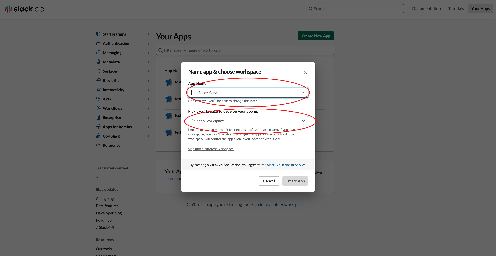
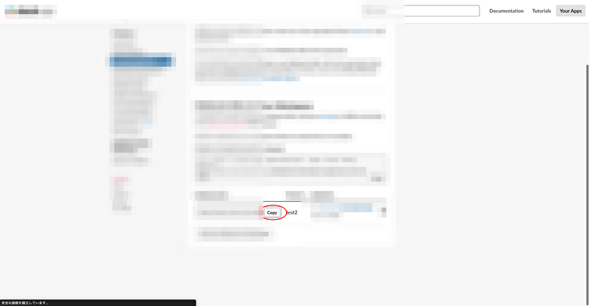

# !!!!!!!注意!!!!!!!!!
!!まだ完成していないです-!!
使用するのはご注意ください!!!!!!!

# 勤怠
## 作成したきっかけ
現在、所属先の会社では、勤怠管理にMiterasというアプリケーションを利用しています。
出社、退社時には、打刻をしたのち、Slackでその旨を報告することになっています。
そのため、毎回、MiterasとSlackを立ち上げ、操作することに少し手間がかかっていました。
そこで、パソコンを起動するだけで、出社、退社を行えるようにしたいと思い、このnpmを作成しました。

## 初期設定
### npmのインストール
### slackapiのURIを生成
[ここ](https://api.slack.com/)にアクセス

赤丸のボタンをクリック

「Form search」をクリック

アプリ名とワークスペースを入力する

「Incoming Webhooks」を入力する

「Active Incoming Webhooks」をOnにする


「Add New Webhook to Workspace」をクリックする


送信先チャンネルを入力して、「許可する」をクリック


生成されたURI※1をコピーする

## 使用方法
```
diligence.js [-o -r]  [MiterasLoginUsername] [MiterasLoginPassword] [FeeilingImage] [SlackApiUri] [message]
```
- 出勤時は-o、退勤時は-rを渡してください。
- FeelingImageは、、最も調子が良いの場合は、1、調子が良い場合は、2、普通の場合は、- 3、悲しい場合は、4を渡してください。
- SlackApiUriは、※1を入力してください。
- messageは、Slackに送信するメッセージを送信してください。
